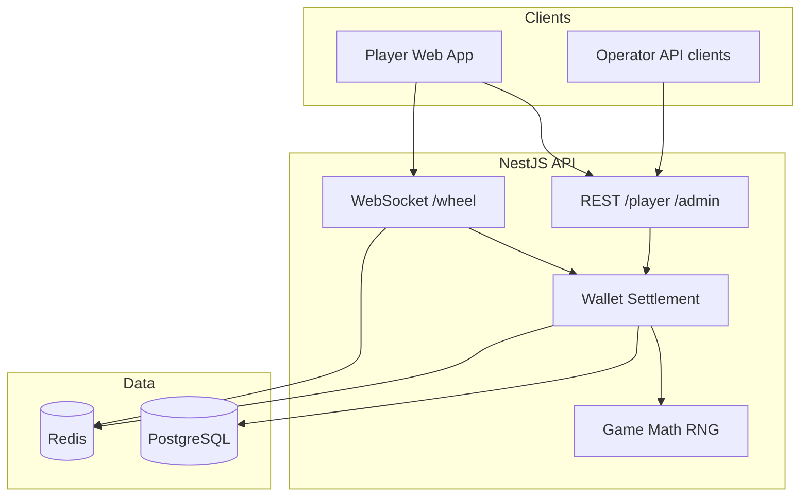

# spinyWheely

iGaming monorepo — **backend** (NestJS operator API) and **frontend** (React player client), orchestrated with npm workspaces.

## Architecture



Full diagrams: **[docs/ARCHITECTURE.md](docs/ARCHITECTURE.md)**

| Package | Docs |
|---------|------|
| Backend API | [backend/README.md](backend/README.md) |
| Player client | [frontend/README.md](frontend/README.md) |
| Tests | [tests/README.md](tests/README.md) |
| Scaling / K8s | [deploy/SCALING.md](deploy/SCALING.md) |
| Fly.io (production) | [deploy/fly/README.md](deploy/fly/README.md) |

## Repository layout

```
spiny-wheely/
├── backend/                 # NestJS API
├── frontend/                # React + Vite
├── tests/                   # Unit, API, e2e, load
├── docs/                    # Architecture
├── deploy/fly/              # Fly.io production deploy
├── deploy/kubernetes/       # K8s manifests (horizontal scaling)
├── docker-compose.yml       # Local Postgres + Redis
└── docker-compose.scale.yml   # Multi-instance API POC
```

## Prerequisites

- **Node.js** ≥ 20
- **Docker** — Postgres on `localhost:5433`, Redis on `localhost:6379`

## Quick start (local)

```bash
docker compose up -d
npm install
cp backend/.env.example backend/.env
npm run migration:run
npm run dev                   # API :3000 + client :5173
```

Open [http://localhost:5173/login](http://localhost:5173/login).

| Tab | Email | Password |
|-----|-------|----------|
| **Player** | `demo@spinywheely.test` | `player123` |
| **Operator** | `admin@spinywheely.test` | `admin123` |

### Verify

```bash
npm run build
npm run test                  # 68 tests — boots API via Docker if needed
curl http://localhost:3000/health
curl http://localhost:3000/health/ready   # database + redis
```

| Service | URL |
|---------|-----|
| Client | http://localhost:5173 |
| API | http://localhost:3000 |
| Wheel WS | ws://localhost:3000/wheel |

## Test accounts

Seeded by migrations (`npm run migration:run`):

| Role | Email | Password | Balance |
|------|-------|----------|---------|
| Player | `player@spinywheely.test` | `player123` | $5,000 |
| Demo | `demo@spinywheely.test` | `player123` | $5,000 |
| Operator | `admin@spinywheely.test` | `admin123` | — |

## Scripts

| Command | Description |
|---------|-------------|
| `npm run dev` | Backend + frontend |
| `npm run build` | Build both packages |
| `npm run migration:run` | Database migrations |
| `npm run test` | Full test suite (68 tests) |
| `npm run test:unit` | Unit tests only (45 tests) |
| `npm run test:load:heavy` | Load / stress test |
| `npm run scale:up` | 3 API replicas + nginx on :8080 |
| `npm run k8s:deploy` | Deploy to Kubernetes |

## Deploy

Production runs on **Fly.io** (Postgres + Redis + API + web in one machine):

```bash
bash deploy/fly/setup.sh
```

Live app: **https://spinywheely.fly.dev**

For horizontal scaling beyond one machine, see **[deploy/SCALING.md](deploy/SCALING.md)** (Docker Compose POC + Kubernetes manifests).
