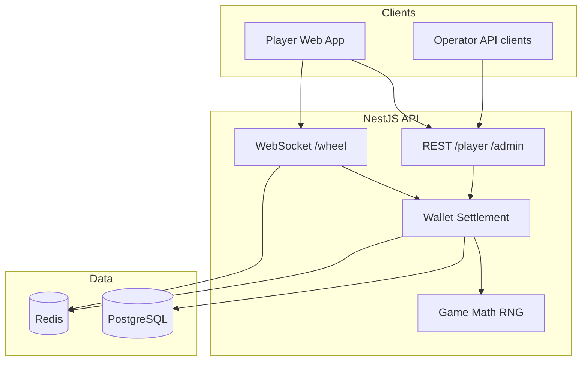

# spinyWheely

iGaming monorepo — **backend** (NestJS operator API) and **frontend** (React player client), orchestrated with npm workspaces.

## Architecture




Full diagrams (sequence flows, module map, scaling): **[docs/ARCHITECTURE.md](docs/ARCHITECTURE.md)**


| Package       | Docs                                     |
| ------------- | ---------------------------------------- |
| Backend API   | [backend/README.md](backend/README.md)   |
| Player client | [frontend/README.md](frontend/README.md) |
| Tests         | [tests/README.md](tests/README.md)       |
| Scaling / K8s | [deploy/SCALING.md](deploy/SCALING.md)   |


## Repository layout

```
spiny-wheely/
├── backend/              # @spiny-wheely/backend — NestJS API
├── frontend/             # @spiny-wheely/frontend — React + Vite
├── tests/                # Unit, API, e2e, load tests
├── docs/                 # Architecture diagrams
├── deploy/               # Docker nginx, K8s manifests, deploy scripts
├── docker-compose.yml    # PostgreSQL + Redis
└── docker-compose.scale.yml  # Multi-instance API POC
```

## Quick start

```bash
docker compose up -d          # PostgreSQL + Redis
npm install
cp backend/.env.example backend/.env
npm run migration:run         # seed users, wallets, game config
npm run dev                   # API :3000 + client :5173
```

> **Operator login:** open [http://localhost:5173/login](http://localhost:5173/login), choose the **Operator** tab, then sign in with `admin@spinywheely.test` / `admin123`. Admin credentials do not work on the Player tab.


| Service  | URL                                            |
| -------- | ---------------------------------------------- |
| Client   | [http://localhost:5173](http://localhost:5173) |
| API      | [http://localhost:3000](http://localhost:3000) |
| Wheel WS | ws://localhost:3000/wheel                      |


## Test accounts

Seeded by migrations (`npm run migration:run`) in **development and production**.


| Role        | Email                     | Password    | Starting balance |
| ----------- | ------------------------- | ----------- | ---------------- |
| Player      | `player@spinywheely.test` | `player123` | **$5,000**       |
| Demo player | `demo@spinywheely.test`   | `player123` | **$5,000**       |
| Operator    | `admin@spinywheely.test`  | `admin123`  | —                |


> For a real production deployment, rotate or remove demo credentials after go-live.

## Scripts


| Command                   | Description                     |
| ------------------------- | ------------------------------- |
| `npm run dev`             | Backend + frontend              |
| `npm run build`           | Build both packages             |
| `npm run migration:run`   | Database migrations             |
| `npm run test`            | Full test suite                 |
| `npm run test:load:heavy` | Load / stress test              |
| `npm run scale:up`        | 3 API replicas + nginx on :8080 |
| `npm run k8s:deploy`      | Deploy to Kubernetes            |


